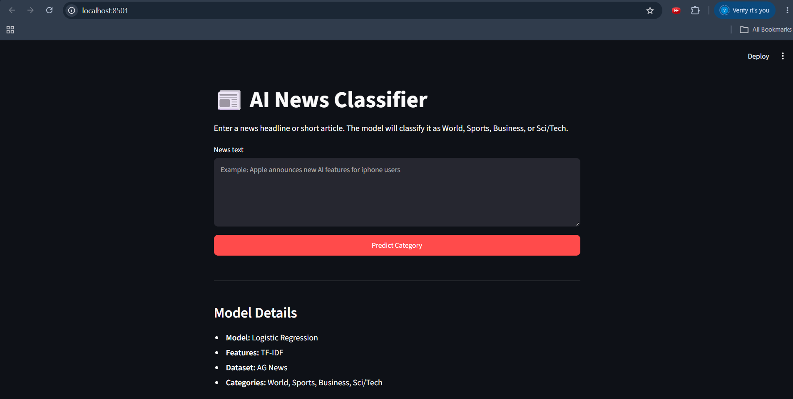
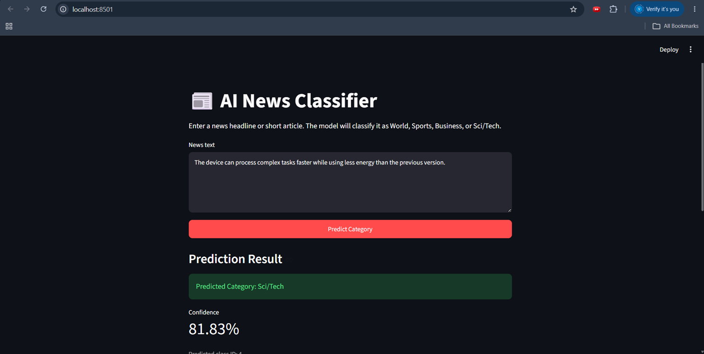
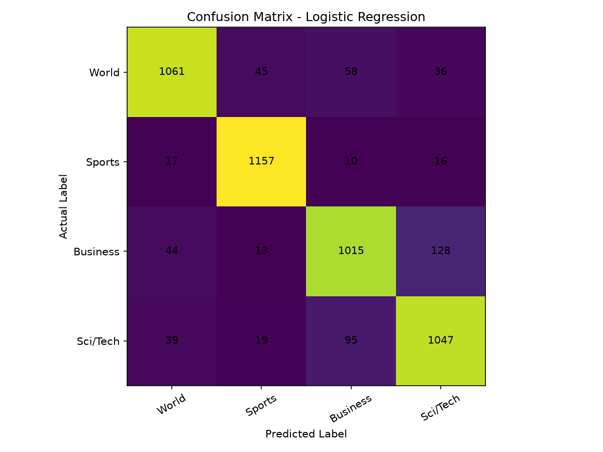

# AI News Classifier + Similar Article Search API

A laptop-friendly AI/ML project that currently classifies English news text
into one of four categories using TF-IDF and Logistic Regression.

The completed Week 1 version includes model training, evaluation, reusable
prediction scripts, prediction confidence, and a Streamlit web interface.

Semantic similar-article search using SentenceTransformers and ChromaDB is
planned for Week 2.

## Current Features

- Accepts a news headline or short article
- Performs light text cleaning
- Converts text using the saved TF-IDF vectorizer
- Predicts one of four news categories
- Displays prediction confidence
- Displays the predicted class ID
- Provides a Streamlit browser interface
- Handles empty user input
- Loads the saved model without retraining

## Supported Categories

| Class ID | Category |
|---:|---|
| 1 | World |
| 2 | Sports |
| 3 | Business |
| 4 | Sci/Tech |

## Machine Learning Pipeline

```text
AG News dataset
        ↓
Column renaming and label mapping
        ↓
Title and description combined
        ↓
Light text cleaning
        ↓
Balanced dataset sampling
        ↓
Train/test split
        ↓
TF-IDF vectorization
        ↓
Logistic Regression training
        ↓
Model evaluation
        ↓
Model package saved with joblib
        ↓
Reusable prediction function
        ↓
Streamlit interface
```

## Main Files

| File | Responsibility |
|---|---|
| `src/preprocessing.py` | Cleans and prepares news text |
| `src/train_model.py` | Trains, evaluates, and saves the classifier |
| `src/predict.py` | Loads the saved model and makes predictions |
| `app/streamlit_app.py` | Provides the Streamlit user interface |
| `models/news_classifier_pipeline.joblib` | Stores the vectorizer, classifier, and label mapping |

## Training Configuration

The stronger saved classifier currently uses:

- Dataset: AG News
- Rows per category: 6,000
- Total rows: 24,000
- Training rows: 19,200
- Test rows: 4,800
- Train/test ratio: 80/20
- TF-IDF maximum features: 10,000
- Classifier: Logistic Regression
- Maximum iterations: 1,000

## Model Results

### Baseline Evaluation

One baseline evaluation produced:

- Test accuracy: 89.25%
- World F1-score: 0.90
- Sports F1-score: 0.94
- Business F1-score: 0.87
- Sci/Tech F1-score: 0.86

The main confusion occurred between Business and Sci/Tech because these
categories can share vocabulary related to companies, products, software,
markets, and technology.

### Model Comparison

Logistic Regression and Multinomial Naive Bayes were compared using the same
prepared dataset, train/test split, and TF-IDF features.

| Model | Accuracy |
|---|---:|
| Logistic Regression | 85.69% |
| Multinomial Naive Bayes | 85.81% |

Multinomial Naive Bayes performed slightly better in this experiment, but the
difference was very small. Both models performed almost the same.

Results varied slightly between separately prepared experiment runs. Fair model
comparisons were made using the same dataset split and feature representation.

## Project Structure

```text
news-intelligence-api/
├── app/
│   └── streamlit_app.py
├── data/
│   ├── raw/
│   ├── sample_news.csv
│   └── README.md
├── docs/
│   └── week1_progress.md
├── models/
│   └── news_classifier_pipeline.joblib
├── notebooks/
│   ├── 01_data_exploration.ipynb
│   ├── 02_model_experiment.ipynb
│   ├── 03_evaluation_model_saving.ipynb
│   └── 04_model_comparison.ipynb
├── screenshots/
│   ├── confusion_matrix.png
│   ├── streamlit_home.png
│   ├── streamlit_prediction.png
│   └── streamlit_validation.png
├── src/
│   ├── __init__.py
│   ├── preprocessing.py
│   ├── train_model.py
│   └── predict.py
├── tests/
├── .gitignore
├── README.md
└── requirements.txt
```

## Installation

### 1. Clone the repository

```bash
git clone <your-repository-url>
cd news-intelligence-api
```

### 2. Create a virtual environment

```bash
python -m venv .venv
```

### 3. Activate the virtual environment on Windows

```powershell
.venv\Scripts\activate
```

### 4. Install dependencies

```bash
python -m pip install -r requirements.txt
```

## Run the Prediction Script

From the project root:

```bash
python -m src.predict
```

## Run the Streamlit App

From the project root:

```bash
python -m streamlit run app/streamlit_app.py
```

The application normally opens at:

```text
http://localhost:8501
```

## Sample Prediction

Input:

```text
The device can process complex tasks faster while using less energy than the
previous version.
```

Output:

```text
Predicted category: Sci/Tech
Confidence: 81.83%
```

The exact confidence depends on the saved model version.

## Screenshots

### Streamlit Home Page



### Prediction Result



### Confusion Matrix



## Current Limitations

- The classifier supports only four AG News categories.
- It was trained mainly on English news text.
- TF-IDF learns statistical word patterns but does not deeply understand meaning.
- Very short or ambiguous input may produce unreliable predictions.
- High confidence does not guarantee that a prediction is correct.
- Similar-article search has not yet been implemented.
- The Streamlit application currently runs locally.

## Planned Improvements

- Generate article embeddings using `all-MiniLM-L6-v2`
- Store article embeddings in ChromaDB
- Return the top five semantically similar articles
- Combine classification and similar-article search
- Add FastAPI endpoints
- Add automated tests
- Add a basic Dockerfile

## Development Progress

Detailed Week 1 development notes are available here:

[View Week 1 Progress](docs/week1_progress.md)

## Development Progress

- [View Week 1 Progress](docs/week1_progress.md)
- [View Week 2 Progress](docs/week2_progress.md)

- Generated 384-dimensional embeddings for 1,000 balanced AG News articles
- Stored 1,000 article embeddings and metadata in persistent ChromaDB storage
- Added validation for record alignment, unique IDs, and collection persistence