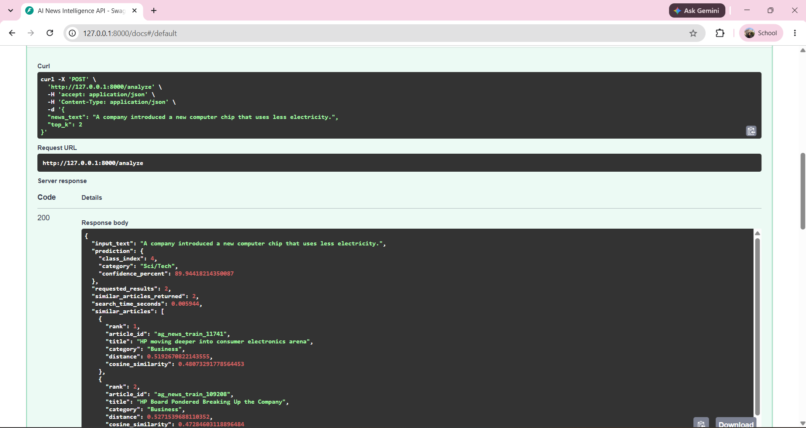

# AI News Classifier + Similar Article Search API

A laptop-friendly AI News Intelligence project that classifies English news text and retrieves semantically similar stored articles.

The classifier uses **TF-IDF + Logistic Regression** to predict one of four AG News categories. Semantic search uses **MiniLM embeddings + ChromaDB** to retrieve related articles.

The combined workflow is available through:

* Streamlit
* FastAPI
* Dockerized FastAPI

---

## Features

* Accepts a news headline or short article
* Predicts one of four AG News categories
* Returns predicted class ID and confidence
* Uses a saved TF-IDF vectorizer and Logistic Regression model
* Generates 384-dimensional MiniLM embeddings
* Searches a persistent ChromaDB collection
* Retrieves top-k semantically similar articles
* Returns cosine distance and cosine similarity
* Combines classification and retrieval through `analyze_news()`
* Provides a Streamlit interface
* Provides FastAPI endpoints for prediction and retrieval
* Uses Pydantic request and response validation
* Loads MiniLM and ChromaDB once during FastAPI startup
* Supports local Docker containerization
* Provides interactive API documentation through `/docs`

---

## Supported Categories

| Class ID | Category |
| -------: | -------- |
|        1 | World    |
|        2 | Sports   |
|        3 | Business |
|        4 | Sci/Tech |

---

## Architecture

```text
News text
   |
   +--> TF-IDF Vectorizer
   |        |
   |        +--> Logistic Regression
   |                 |
   |                 +--> class + confidence
   |
   +--> MiniLM
            |
            +--> 384-dimensional embedding
                     |
                     +--> ChromaDB
                              |
                              +--> similar articles
```

The reusable analysis layer is exposed through:

```text
Core Python functions
        |
        +--> Streamlit UI
        |
        +--> FastAPI
                |
                +--> Docker container
```

---

## Classification vs Semantic Retrieval

The project combines two different tasks.

### Classification

Answers:

```text
Which AG News category best describes this input?
```

Returns:

* class index
* category
* confidence percentage

### Semantic Retrieval

Answers:

```text
Which stored articles are closest to this input in embedding space?
```

Returns:

* rank
* article ID
* title
* category
* cosine distance
* cosine similarity

The classifier category and the Rank 1 retrieved article category do not always need to match.

Classification assigns a class, while semantic search ranks articles by meaning.

---

## Technology Stack

* Python
* Pandas
* NumPy
* Hugging Face Datasets
* scikit-learn
* TF-IDF
* Logistic Regression
* joblib
* SentenceTransformers
* `all-MiniLM-L6-v2`
* ChromaDB
* Streamlit
* FastAPI
* Pydantic
* Uvicorn
* Matplotlib
* Jupyter Notebook
* Docker
* Git and GitHub

---

## Training Configuration

The stronger saved classifier uses:

* Dataset: AG News
* Rows per category: 6,000
* Total rows: 24,000
* Training rows: 19,200
* Test rows: 4,800
* Train/test split: 80/20
* TF-IDF maximum features: 10,000
* Classifier: Logistic Regression
* Maximum iterations: 1,000

---

## Model Results

### Baseline Evaluation

One baseline experiment produced:

* Accuracy: **89.25%**
* World F1-score: **0.90**
* Sports F1-score: **0.94**
* Business F1-score: **0.87**
* Sci/Tech F1-score: **0.86**

The main confusion occurred between **Business** and **Sci/Tech** because these categories can share vocabulary related to companies, products, software, markets, and technology.

### Logistic Regression vs Naive Bayes

A separate comparison experiment produced:

| Model                   | Accuracy |
| ----------------------- | -------: |
| Logistic Regression     |   85.69% |
| Multinomial Naive Bayes |   85.81% |

The difference was very small, so this experiment did not show a meaningful winner.

These scores came from a separate experimental configuration and should not be treated as the same evaluation as the baseline result above.

---

## Semantic Search Configuration

* Embedding model: `sentence-transformers/all-MiniLM-L6-v2`
* Embedding dimension: 384
* Indexed articles: 1,000
* Articles per category: 250
* ChromaDB collection: `ag_news_articles`
* Persistent path: `data/chroma_db`
* Distance metric: cosine
* Default results: 5

For the current cosine configuration:

```text
Lower cosine distance
→ closer semantic match

Higher cosine similarity
→ closer semantic match
```

Cosine similarity is **not** classifier confidence and should not be interpreted as a probability.

---

## Project Structure

```text
news-intelligence-api/
├── app/
│   ├── streamlit_app.py
│   └── fastapi_app.py
│
├── data/
│   ├── raw/
│   ├── processed/
│   └── chroma_db/
│
├── docs/
│   ├── week1_progress.md
│   ├── week2_progress.md
│   └── week3_progress.md
│
├── models/
│   └── news_classifier_pipeline.joblib
│
├── notebooks/
│   ├── 01_data_exploration.ipynb
│   ├── 02_model_experiment.ipynb
│   ├── 03_evaluation_model_saving.ipynb
│   └── 04_model_comparison.ipynb
│
├── screenshots/
│   ├── confusion_matrix.png
│   ├── day13_combined_streamlit_ui.png
│   ├── streamlit_home.png
│   ├── streamlit_prediction.png
│   └── streamlit_validation.png
│
├── src/
│   ├── preprocessing.py
│   ├── train_model.py
│   ├── predict.py
│   ├── embedding_demo.py
│   ├── generate_embeddings.py
│   ├── store_embeddings.py
│   ├── search_articles.py
│   └── analyze_news.py
│
├── Dockerfile
├── .dockerignore
├── .gitignore
├── requirements.txt
└── README.md
```

Generated models, embeddings, raw data, and ChromaDB files are intentionally ignored by Git.

---

# Setup

## 1. Clone the repository

```powershell
git clone https://github.com/RupeshBash/news-intelligence-api.git
cd news-intelligence-api
```

## 2. Create a virtual environment

```powershell
python -m venv .venv
```

## 3. Activate it on Windows

```powershell
.\.venv\Scripts\Activate.ps1
```

## 4. Install dependencies

```powershell
python -m pip install --upgrade pip
python -m pip install -r requirements.txt
```

---

## Prepare Required Local Artifacts

Some generated resources are intentionally excluded from Git.

A fresh clone must generate them locally before running the complete application.

### 1. Train and save the classifier

```powershell
python -m src.train_model
```

This creates:

```text
models/news_classifier_pipeline.joblib
```

The saved package contains the fitted TF-IDF vectorizer, classifier, and label mapping.

### 2. Generate article embeddings

```powershell
python -m src.generate_embeddings
```

This creates:

```text
data/processed/article_embeddings.npy
data/processed/article_metadata.csv
```

### 3. Store embeddings in ChromaDB

```powershell
python -m src.store_embeddings
```

This creates the persistent collection under:

```text
data/chroma_db/
```

The current collection contains 1,000 sampled AG News articles.

---

# Run Locally

Run commands from the project root.

## Standalone Classification

```powershell
python -m src.predict
```

## Embedding Demo

```powershell
python -m src.embedding_demo
```

## Semantic Search

```powershell
python -m src.search_articles
```

## Combined Analysis

```powershell
python -m src.analyze_news
```

---

# Streamlit Interface

Run:

```powershell
python -m streamlit run app\streamlit_app.py
```

Open:

```text
http://localhost:8501
```

The interface displays:

* predicted class index
* predicted category
* confidence percentage
* search time
* similar articles
* article category
* cosine distance
* cosine similarity
* article ID

MiniLM and ChromaDB resources are cached using `st.cache_resource` to avoid unnecessary loading during Streamlit reruns.


---

# FastAPI

Run:

```powershell
python -m uvicorn app.fastapi_app:app --reload
```

API:

```text
http://127.0.0.1:8000
```

Interactive Swagger documentation:

```text
http://127.0.0.1:8000/docs
```

The FastAPI lifespan loads the following resources once during application startup:

* MiniLM embedding model
* ChromaDB client
* ChromaDB collection
* indexed article count

This avoids loading expensive resources again for every request.

---

## API Endpoints

| Method | Endpoint   | Purpose                                         |
| ------ | ---------- | ----------------------------------------------- |
| GET    | `/health`  | Check API and resource readiness                |
| POST   | `/predict` | Predict news category                           |
| POST   | `/similar` | Retrieve similar articles                       |
| POST   | `/analyze` | Run classification and semantic search together |

---

## GET `/health`

Example:

```text
GET /health
```

Returns information such as:

```text
status
service
embedding_model_loaded
collection_name
indexed_articles
```

Current collection:

```text
ag_news_articles
```

Current indexed article count:

```text
1000
```

---

## POST `/predict`

Request:

```json
{
  "news_text": "A company introduced a new computer chip that uses less electricity."
}
```

Example response:

```json
{
  "input_text": "A company introduced a new computer chip that uses less electricity.",
  "prediction": {
    "class_index": 4,
    "category": "Sci/Tech",
    "confidence_percent": 89.94
  }
}
```

---

## POST `/similar`

Request:

```json
{
  "news_text": "A company introduced a new computer chip that uses less electricity.",
  "top_k": 2
}
```

The response includes:

```text
input_text
requested_results
similar_articles_returned
search_time_seconds
similar_articles
```

Each similar article contains:

```text
rank
article_id
title
category
distance
cosine_similarity
```

`top_k` must currently be between:

```text
1 and 10
```

---

## POST `/analyze`

Request:

```json
{
  "news_text": "A company introduced a new computer chip that uses less electricity.",
  "top_k": 2
}
```

Example response structure:

```json
{
  "input_text": "A company introduced a new computer chip that uses less electricity.",
  "prediction": {
    "class_index": 4,
    "category": "Sci/Tech",
    "confidence_percent": 89.94
  },
  "requested_results": 2,
  "similar_articles_returned": 2,
  "search_time_seconds": 0.003,
  "similar_articles": [
    {
      "rank": 1,
      "article_id": "ag_news_train_11741",
      "title": "HP moving deeper into consumer electronics arena",
      "category": "Business",
      "distance": 0.5193,
      "cosine_similarity": 0.4807
    }
  ]
}
```

The classifier category and retrieved article category can differ because classification and semantic retrieval solve different tasks.

---

## API Validation

Pydantic validates incoming requests and outgoing responses.

Examples:

```text
Valid request
→ 200

Whitespace-only news_text
→ 422

top_k = 0
→ 422

top_k = 11
→ 422
```

Request text is limited to a maximum of 5,000 characters.

---

# Docker

The FastAPI application can also run inside a local Linux Docker container.

Before building the image, make sure the generated classifier and ChromaDB artifacts exist locally.

## Build

```powershell
docker build -t ai-news-intelligence .
```

The final `.` is the Docker build context and is required.

## Run

```powershell
docker run --name ai-news-api -p 8000:8000 ai-news-intelligence
```

Port mapping:

```text
host 8000
→ container 8000
```

Open:

```text
http://127.0.0.1:8000/docs
```

## Stop

```powershell
docker stop ai-news-api
```

## Start the existing container again

```powershell
docker start ai-news-api
```

## Remove the container

```powershell
docker rm ai-news-api
```

Docker packages the application locally. It does **not** mean the project is publicly deployed.

---

## Docker Build Notes

The Dockerfile uses:

```text
python:3.12-slim-bookworm
```

Dependencies are copied and installed before the application source:

```dockerfile
COPY requirements.txt .
RUN pip install --no-cache-dir -r requirements.txt
COPY . .
```

This allows Docker to reuse the dependency layer when only application code changes.

The current image is relatively large because the environment contains ML libraries and development dependencies.

Reducing the production dependency set is a future improvement.

---

# Screenshots

## Combined Streamlit Interface


## FastAPI Combined Analysis



## Confusion Matrix


---


# Current Limitations

* Supports only the four AG News categories.
* Designed mainly for English news text.
* Semantic search uses only 1,000 sampled articles.
* Very short or ambiguous input can produce weak predictions.
* High classifier confidence does not guarantee correctness.
* High cosine similarity does not guarantee true relevance.
* TF-IDF does not deeply represent semantic meaning.
* The classifier and nearest retrieved article may have different category labels.
* Generated model and ChromaDB artifacts are not stored in Git.
* A fresh clone must generate local artifacts before running the complete system.
* Docker image size is currently large.
* No automated API integration test suite has been added yet.
* No authentication is implemented.
* The project is not publicly deployed.

---

# Future Improvements

* Add automated FastAPI and integration tests
* Reduce Docker image size
* Create a smaller production dependency list
* Improve semantic-search evaluation
* Increase the indexed article collection when hardware permits
* Improve model evaluation and experiment tracking
* Add better logging and error monitoring
* Deploy the API to a remote service

---

# Development Progress

* [Week 1 Progress](docs/week1_progress.md)
* [Week 2 Progress](docs/week2_progress.md)
* [Week 3 Progress](docs/week3_progress.md)

---

# Project Status

```text
Week 1
Classical ML classifier
Status: Complete

Week 2
MiniLM embeddings, ChromaDB, semantic search,
combined analysis, and Streamlit
Status: Complete

Week 3
FastAPI endpoints and Docker containerization
Status: Complete

Current core functionality
Status: Complete

Public deployment
Status: Not implemented
```

---

## Summary

This project demonstrates an end-to-end laptop-friendly AI/ML workflow:

```text
AG News
   ↓
TF-IDF + Logistic Regression
   ↓
News classification

AG News sample
   ↓
MiniLM embeddings
   ↓
ChromaDB
   ↓
Semantic retrieval

Classification + Retrieval
   ↓
Streamlit
   ↓
FastAPI
   ↓
Docker
```

The project focuses on reusable ML code, semantic search, API design, validation, local persistence, and containerization without requiring a GPU or large-scale infrastructure.
