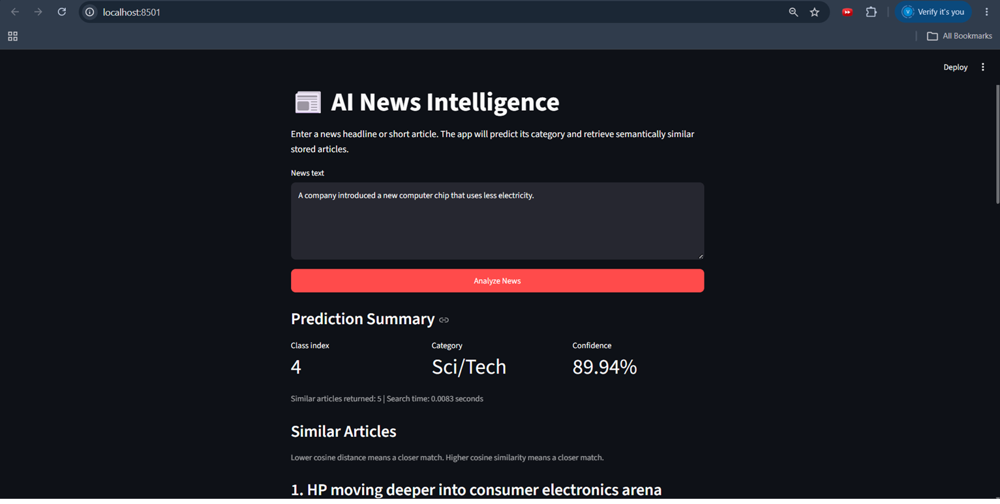
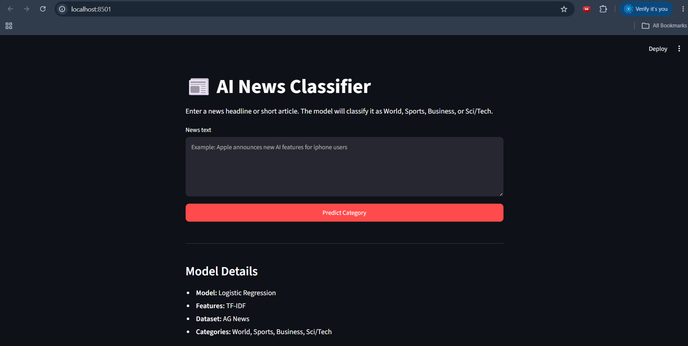
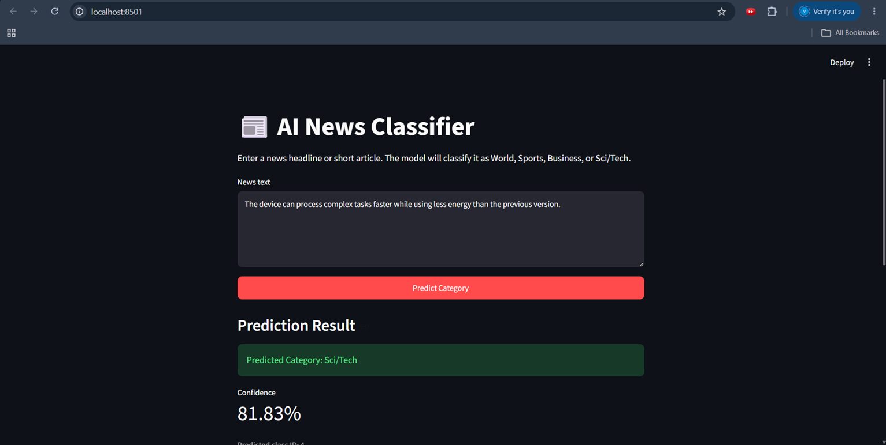
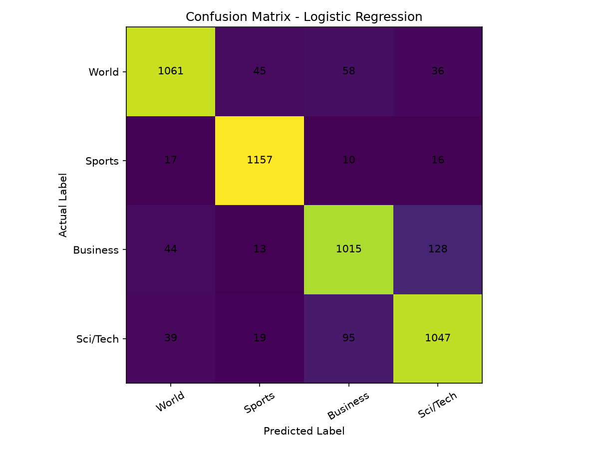

# AI News Classifier + Similar Article Search API

A laptop-friendly AI News Intelligence project that classifies English news
text and retrieves semantically similar stored articles.

The classifier uses TF-IDF and Logistic Regression to predict one of four AG
News categories. The semantic-search workflow uses MiniLM embeddings and a
persistent ChromaDB collection containing 1,000 sampled articles.

The combined workflow is available through a Streamlit web interface. FastAPI
endpoints are planned for the next development stage.

---

## Current Features

- Accepts a news headline or short article
- Performs light text cleaning
- Predicts one of four AG News categories
- Displays the predicted class ID
- Displays prediction confidence
- Uses a saved TF-IDF vectorizer and Logistic Regression model
- Generates 384-dimensional MiniLM query embeddings
- Searches a persistent ChromaDB collection
- Retrieves the top five semantically similar articles
- Displays article category, cosine distance, and cosine similarity
- Combines classification and retrieval through `analyze_news()`
- Caches MiniLM and ChromaDB resources in Streamlit
- Handles empty input, missing values, and processing errors
- Loads saved resources without retraining during prediction

---

## Supported Categories

| Class ID | Category |
|---:|---|
| 1 | World |
| 2 | Sports |
| 3 | Business |
| 4 | Sci/Tech |

---

## System Workflow

```text
User enters news text
        |
        +--> TF-IDF vectorizer
        |        |
        |        +--> Logistic Regression
        |                 |
        |                 +--> category + confidence
        |
        +--> MiniLM embedding model
                 |
                 +--> 384-dimensional query embedding
                          |
                          +--> ChromaDB cosine search
                                   |
                                   +--> top five similar articles
        |
        +--> Combined result displayed in Streamlit
```

---

## Main Files

| File | Responsibility |
|---|---|
| `src/preprocessing.py` | Cleans and prepares news text |
| `src/train_model.py` | Trains, evaluates, and saves the classifier |
| `src/predict.py` | Loads the saved model and predicts category and confidence |
| `src/embedding_demo.py` | Demonstrates MiniLM embeddings and cosine similarity |
| `src/generate_embeddings.py` | Generates embeddings for sampled AG News articles |
| `src/store_embeddings.py` | Stores article embeddings and metadata in ChromaDB |
| `src/search_articles.py` | Embeds a query and retrieves similar articles |
| `src/analyze_news.py` | Combines classification and semantic retrieval |
| `app/streamlit_app.py` | Displays the combined workflow through Streamlit |
| `models/news_classifier_pipeline.joblib` | Stores the vectorizer, classifier, and label mapping |

---

## Training Configuration

The stronger saved classifier currently uses:

- Dataset: AG News
- Rows per category: 6,000
- Total rows: 24,000
- Training rows: 19,200
- Test rows: 4,800
- Train/test ratio: 80/20
- TF-IDF maximum features: 10,000
- Classifier: Logistic Regression
- Maximum iterations: 1,000

---

## Model Results

### Baseline Evaluation

One baseline evaluation produced:

- Test accuracy: 89.25%
- World F1-score: 0.90
- Sports F1-score: 0.94
- Business F1-score: 0.87
- Sci/Tech F1-score: 0.86

The main confusion occurred between Business and Sci/Tech because these
categories can share vocabulary related to companies, products, software,
markets, and technology.

### Model Comparison

Logistic Regression and Multinomial Naive Bayes were compared using the same
prepared dataset, train/test split, and TF-IDF features.

| Model | Accuracy |
|---|---:|
| Logistic Regression | 85.69% |
| Multinomial Naive Bayes | 85.81% |

Multinomial Naive Bayes performed slightly better in this experiment, but the
difference was very small. Both models performed almost the same.

Results varied slightly between separately prepared experiment runs. A fair
comparison requires the same dataset split and feature representation.

---

## Semantic Search Configuration

The current semantic-search stage uses:

- Embedding model: `all-MiniLM-L6-v2`
- Embedding dimension: 384
- Indexed articles: 1,000
- Articles per category: 250
- ChromaDB collection: `ag_news_articles`
- Persistent database path: `data/chroma_db`
- Distance method: Cosine
- Default results returned: 5

The query text is converted into a MiniLM embedding and compared with stored
article embeddings.

For the current cosine configuration:

```text
Lower cosine distance
→ closer semantic match

Higher cosine similarity
→ closer semantic match
```

Cosine similarity is not the same as classifier confidence.

---

## Classification and Retrieval

The project combines two related but different tasks.

### Classification

Classification answers:

```text
Which AG News category best describes this input?
```

It returns:

- Class index
- Category label
- Confidence percentage

### Semantic retrieval

Semantic retrieval answers:

```text
Which stored articles are closest to this input in embedding space?
```

It returns:

- Rank
- Article title
- Article category
- Article ID
- Cosine distance
- Cosine similarity

The predicted category and the category of the nearest stored article do not
always need to match.

---

## Project Structure

```text
news-intelligence-api/
|-- app/
|   |-- .gitkeep
|   `-- streamlit_app.py
|-- data/
|   |-- raw/
|   |-- processed/
|   |   |-- article_embeddings.npy
|   |   `-- article_metadata.csv
|   `-- chroma_db/
|-- docs/
|   |-- week1_progress.md
|   `-- week2_progress.md
|-- models/
|   `-- news_classifier_pipeline.joblib
|-- notebooks/
|   |-- 01_data_exploration.ipynb
|   |-- 02_model_experiment.ipynb
|   |-- 03_evaluation_model_saving.ipynb
|   `-- 04_model_comparison.ipynb
|-- screenshots/
|   |-- confusion_matrix.png
|   |-- streamlit_home.png
|   |-- streamlit_prediction.png
|   |-- streamlit_validation.png
|   `-- day13_combined_streamlit_ui.png
|-- src/
|   |-- __init__.py
|   |-- preprocessing.py
|   |-- train_model.py
|   |-- predict.py
|   |-- embedding_demo.py
|   |-- generate_embeddings.py
|   |-- store_embeddings.py
|   |-- search_articles.py
|   `-- analyze_news.py
|-- tests/
|-- .gitignore
|-- README.md
`-- requirements.txt
```

The saved model, generated embeddings, metadata, raw dataset, and local
ChromaDB database are generated locally and remain ignored by Git.

---

## Technology Stack

- Python
- Pandas
- NumPy
- Hugging Face Datasets
- scikit-learn
- joblib
- SentenceTransformers
- ChromaDB
- Streamlit
- Matplotlib
- Jupyter Notebook
- Git and GitHub

---

## Installation

### 1. Clone the repository

```powershell
git clone https://github.com/RupeshBash/news-intelligence-api.git
cd news-intelligence-api
```

### 2. Create a virtual environment

```powershell
python -m venv .venv
```

### 3. Activate the virtual environment on Windows

```powershell
.\.venv\Scripts\Activate.ps1
```

### 4. Install dependencies

```powershell
python -m pip install --upgrade pip
python -m pip install -r requirements.txt
```

---

## Prepare Local Project Resources

Generated resources are ignored by Git and may need to be created locally after
cloning the repository.

### Train and save the classifier

```powershell
python -m src.train_model
```

This creates the local saved model package used during prediction.

### Generate article embeddings

```powershell
python -m src.generate_embeddings
```

This creates:

```text
data/processed/article_embeddings.npy
data/processed/article_metadata.csv
```

### Store articles in ChromaDB

```powershell
python -m src.store_embeddings
```

This creates the persistent local ChromaDB collection.

---

## Run the Project

Run all commands from the project root.

### Run standalone classification

```powershell
python -m src.predict
```

### Run the embedding demonstration

```powershell
python -m src.embedding_demo
```

### Run standalone semantic search

```powershell
python -m src.search_articles
```

### Run combined classification and retrieval

```powershell
python -m src.analyze_news
```

### Run the Streamlit interface

```powershell
python -m streamlit run app\streamlit_app.py
```

The application normally opens at:

```text
http://localhost:8501
```

---

## Sample Combined Analysis

Input:

```text
A company introduced a new computer chip that uses less electricity.
```

Example classification output:

```text
Predicted class index: 4
Predicted category: Sci/Tech
Prediction confidence: 89.94%
```

Example semantic-search output:

```text
Similar articles returned: 5
Embedding shape: (384,)
```

The exact confidence, search time, and retrieved articles depend on the saved
model and current ChromaDB collection.

---

## Streamlit Interface

The Streamlit application accepts a news headline or short article and
displays:

- Predicted class index
- Predicted category
- Confidence percentage
- Vector-search time
- Five semantically similar articles
- Article category
- Cosine distance
- Cosine similarity
- Article ID

The MiniLM model and ChromaDB resources are cached using
`st.cache_resource`, preventing unnecessary reloading during Streamlit reruns.



---

## Additional Screenshots

### Classifier Home Page



### Classification Result



### Confusion Matrix



---

## Current Limitations

- The classifier supports only four AG News categories.
- The classifier was trained mainly on English news text.
- The semantic index contains only 1,000 sampled articles.
- Very short or ambiguous input may produce unreliable results.
- High classifier confidence does not guarantee correctness.
- High cosine similarity does not guarantee genuine relevance.
- TF-IDF does not deeply understand semantic meaning.
- The classifier and nearest article may have different category labels.
- Some development messages are still printed in the terminal.
- The application currently runs locally.
- FastAPI endpoints have not yet been implemented.
- Automated integration tests have not yet been added.

---

## Planned Improvements

- Add FastAPI application structure
- Add `GET /health`
- Add `POST /predict`
- Add `POST /similar`
- Add `POST /analyze`
- Load shared resources once during API startup
- Add request and response validation
- Add automated integration tests
- Add a basic Dockerfile
- Improve semantic-search evaluation
- Increase the number of indexed articles when hardware permits

---

## Development Progress

- [View Week 1 Progress](docs/week1_progress.md)
- [View Week 2 Progress](docs/week2_progress.md)

---

## Current Project Status

```text
Week 1
Classical ML news classifier
Status: Complete

Week 2
Embeddings, ChromaDB, semantic search, combined analysis, and Streamlit
Status: Complete

Week 3
FastAPI, testing, Docker basics, and final project polish
Status: Planned
```